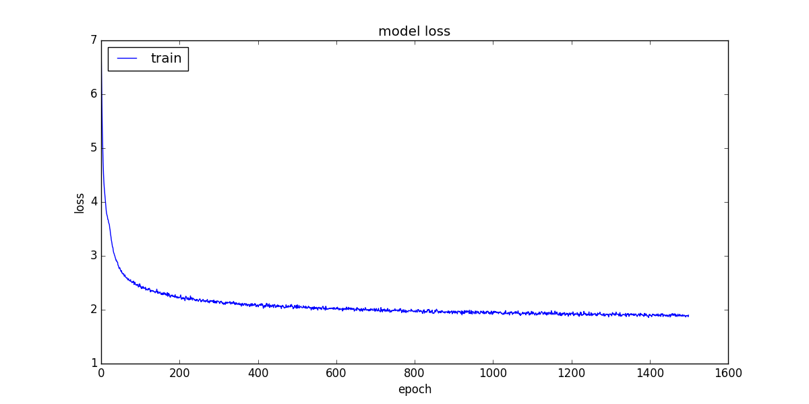

# CNN model
### Preprocessing
* One sample splitted into 9 main tiles 64x64. Plus 4 overlapping
  tiles on the edges of main tiles. Then each tile resized to 16x16.
* Dataset of all tiles standardized (centered + scaled).
### Augmentation
90 degrees, [0.5, 2] zoom, reflect
### Architecture

### Model summary

Layer (type)                | Output Shape           |   Param #   
----------------------------|------------------------|-------------
conv2d_1 (Conv2D)           | (None, 30, 30, 16)     |   160       
max_pooling2d_1 (MaxPooling2| (None, 15, 15, 16)     |   0         
conv2d_2 (Conv2D)           | (None, 13, 13, 32)     |   4640      
max_pooling2d_2 (MaxPooling2| (None, 6, 6, 32)       |   0         
conv2d_3 (Conv2D)           | (None, 4, 4, 64)       |   18496     
max_pooling2d_3 (MaxPooling2| (None, 2, 2, 64)       |   0         
flatten_1 (Flatten)         | (None, 256)            |   0         
dropout_1 (Dropout)         | (None, 256)            |   0         
dense_1 (Dense)             | (None, 111)            |   28527     

Total params: 51,823  
Trainable params: 51,823  
Non-trainable params: 0  

### Results

