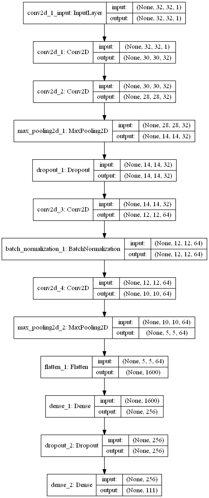

# CNN model
### Preprocessing
* One sample splitted into 9 main tiles 64x64. Plus 4 overlapping
  tiles on the edges of main tiles. Then each tile resized to 16x16.
* Dataset of all tiles standardized (centered + scaled).
### Augmentation
90 degrees, [0.5, 2] zoom, reflect
### Architecture

### Model summary

Layer (type)                 | Output Shape           |   Param #   
-----------------------------|------------------------|-------------
conv2d_1 (Conv2D)            | (None, 14, 14, 16)     |   160       
max_pooling2d_1 (MaxPooling2 | (None, 7, 7, 16)       |   0         
conv2d_2 (Conv2D)            | (None, 5, 5, 32)       |   4640      
max_pooling2d_2 (MaxPooling2 | (None, 2, 2, 32)       |   0         
flatten_1 (Flatten)          | (None, 128)            |   0         
dense_1 (Dense)              | (None, 111)            |   14319     

Total params: 19,119  
Trainable params: 19,119  
Non-trainable params: 0  

### Results

